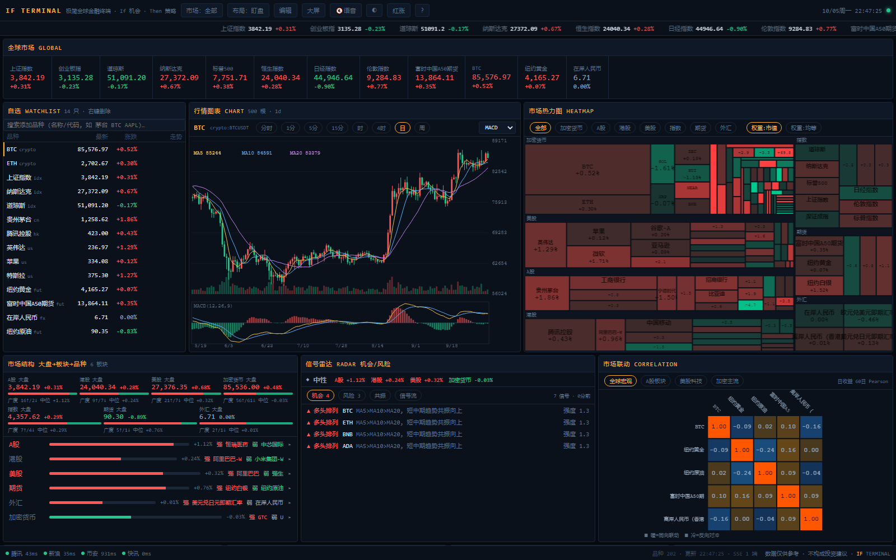
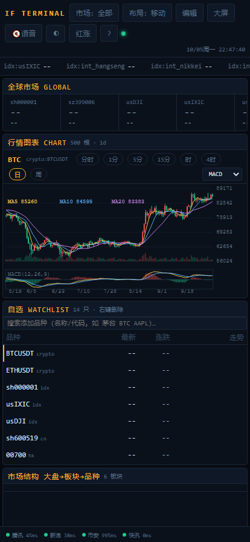

# IF TERMINAL · A Minimal Global Markets Terminal

> **If opportunity · Then strategy** — boxes · cards · plugins · agent-open · TV / multi-screen / mobile · zero cost


> 🔗 **Live Demo → [if.app.workbuddy.host](https://if.app.workbuddy.host/)** — no deploy, no setup, click and go. **Real-time market data, not mocks.**

A **single-file server + pure frontend** markets terminal: global watchlist, treemap heatmap, correlation matrix,
signal radar and strategy backtesting — every capability collapsed into one instruction bus that any external
agent can drive.

**Zero npm dependencies. No build step. No API keys.** Clone it, run `node server.js`, done.


<p align="center"></p>

## Why

| | |
|---|---|
| **Zero dependencies** | Node built-ins + native Web APIs only — no `node_modules`, no bundler, no `npm install` |
| **Zero cost** | All market data comes from free public endpoints; no signup, no API keys |
| **Zero build** | Frontend edits apply on refresh; static files are read from disk per request |
| **Agent-drivable** | One HTTP command selects a symbol, opens a card, announces to the big screen or arms an alert — every window follows |
| **Multi-screen** | Main terminal, TV wall, mobile and card popouts stay in sync via BroadcastChannel + SSE |
| **Installable** | A proper PWA: install to desktop/home screen, open the shell offline |

## Quick start

```bash
git clone https://github.com/x2it/if-terminal.git
cd if-terminal
node server.js          # → http://localhost:8787
```

Verify your environment while you are at it:

```bash
npm test                          # 60 tests (smoke / config / module linking / aggregation / calendar / live stream), no npm install required
```

## Environment variables

| Variable | Default | Description |
|---|---|---|
| `PORT` | `8787` | Listen port |
| `ACCESS_CODE` | empty | When set, every page/API requires the passcode (an “entry” gate, HttpOnly cookie for 7 days). **Empty = fully public** |
| `CORS_ORIGIN` | `*` | Allowed origin for the Agent API; tighten it when wiring your own systems |

```bash
PORT=80 ACCESS_CODE=your-passcode node server.js
```

> ⚠️ With no `ACCESS_CODE`, `/api/agent` is open to anyone who can reach the port. For public deployments set a
> passcode **and** terminate TLS — see [SECURITY.md](SECURITY.md).

## Deployment

**pm2**

```bash
npm i -g pm2
pm2 start server.js --name if-terminal --env ACCESS_CODE=your-passcode
pm2 save && pm2 startup
```

**systemd**

```ini
[Unit]
Description=IF TERMINAL
After=network.target

[Service]
WorkingDirectory=/opt/if-terminal
Environment=PORT=8787
Environment=ACCESS_CODE=your-passcode
ExecStart=/usr/bin/node server.js
Restart=always
User=www-data

[Install]
WantedBy=multi-user.target
```

**Docker**

```bash
docker compose up -d            # or: docker build -t if-terminal:1.0.0 . && docker run -p 8787:8787 if-terminal:1.0.0
```

**Reverse proxy (SSE requires buffering off)**

```nginx
location / {
    proxy_pass http://127.0.0.1:8787;
    proxy_http_version 1.1;
    proxy_set_header Connection "";
    proxy_buffering off;        # otherwise /api/stream gets buffered
}
```

## Install as an app (PWA)

- **Desktop Chrome / Edge**: use the install icon in the address bar, or the “Install” button in the top bar
- **Android Chrome**: menu → Add to Home screen
- **iOS Safari**: Share → Add to Home Screen (iOS has no `beforeinstallprompt`, so no install button appears)

Installed, it runs in its own window and registers a Service Worker that caches the **shell**
(HTML/CSS/JS/icons). Quotes, candles and the SSE stream always go straight to the network — so offline you get
the interface skeleton only.

> Browsers only allow installation and Service Workers on **HTTPS or localhost**.

## Agent API

Any script, LLM tool call or automation can drive the terminal:

```bash
BASE=http://localhost:8787

curl $BASE/api/agent                                  # command schema + execution log
curl -X POST $BASE/api/agent -H 'Content-Type: application/json' \
     -d '{"cmd":"select","args":{"sym":"crypto:ETHUSDT"},"from":"my-agent"}'
curl -X POST $BASE/api/agent -H 'Content-Type: application/json' \
     -d '{"cmd":"announce","args":{"text":"ETH breaking out on the 1h"}}'
```

Commands are broadcast over SSE to **every** open window (main terminal, TV wall, popouts, mobile) — the same
effect as doing it by hand. Full command table and data endpoints: [AGENT-API.md](AGENT-API.md) (Chinese).

## Card plugins (15)

`indices` · `kline` (MA/MACD/RSI/intraday/global crosshair) · `watchlist` · `heatmap` · `structure` · `radar` ·
`corr` · `movers` · `screener` · `quant` · `alerts` · `worldclock` · `agent` · `news` · `system`

A new card is one `registerCard({ type, title, init })` call — see [CONTRIBUTING.md](CONTRIBUTING.md).

## Data sources

| Market | Source | Notes |
|---|---|---|
| A-shares / HK / US (incl. SPY) | Tencent `qt.gtimg.cn` | Real-time snapshots, 4s polling |
| Candles / intraday | Tencent `ifzq.gtimg.cn` | Daily/weekly/monthly (forward-adjusted) + intraday |
| Global indices / futures / FX | Sina `hq.sinajs.cn` | HSI, Nikkei, FTSE, A50, gold, silver, crude, gas, copper, CNH |
| Futures / FX daily candles | Sina `stock2.finance.sina.com.cn` | Used by the radar and correlation matrix |
| Crypto | Binance public endpoint `data-api.binance.vision` | Top 120 USDT pairs (stablecoins/leveraged tokens excluded) |
| 7×24 news flash | Sina Finance live | 40s refresh |

> Free daily-candle sources for global indices do not exist, so ETFs stand in by convention: SPY ≈ S&P 500,
> Tracker Fund (02800) ≈ Hang Seng.

## Project layout

```
server.js                  Zero-dep server: static files + market aggregation + SSE + agent bus + optional gate
public/index.html          Page shell (PWA metadata)
public/manifest.webmanifest / public/sw.js     PWA manifest and Service Worker
public/js/core.js          State · event bus · command bus · market filter · multi-window sync · alerts
public/js/grid.js          Box grid: layout presets / drag & drop / popouts / plugin registry
public/js/chart.js         Candlestick engine      public/js/quant.js  Indicators + backtesting
public/js/plugins/*        market · viz · chart · tools · radar
test/smoke.test.mjs        Smoke tests: service / data contract / kline validity / read-only mode
test/state.test.mjs        Config layer: defaults / snapshots / undo / import validation / lock
test/modules.test.mjs      Module linking: catches "import of a non-existent export"
tools/gen-icons.py         Regenerate PWA icons
```

## Security

Built as a **single-user self-hosted tool**, not a multi-tenant service. The passcode is a shared secret rather
than an account system; with no passcode the Agent API is wide open; the backtesting sandbox evaluates your own
strategy code with `new Function` inside your browser only. Full threat model and implemented hardening:
[SECURITY.md](SECURITY.md).

## Contributing

Issues and PRs are welcome — please read [CONTRIBUTING.md](CONTRIBUTING.md) first: this project is
**deliberately zero-dependency**. Report vulnerabilities privately, never in a public issue.

## Disclaimer

Market data comes from free third-party endpoints and may be delayed, rate-limited or unavailable. It is
**for research and learning only and is not investment advice**. Trade at your own risk.

## License

[MIT](LICENSE) © 2026 知行工作室 Zhixing Studio · [https://w3b.pub/](https://w3b.pub/) · support@w3b.pub

<sub>[中文](README.md)</sub>
